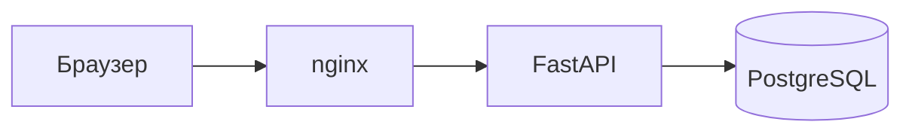
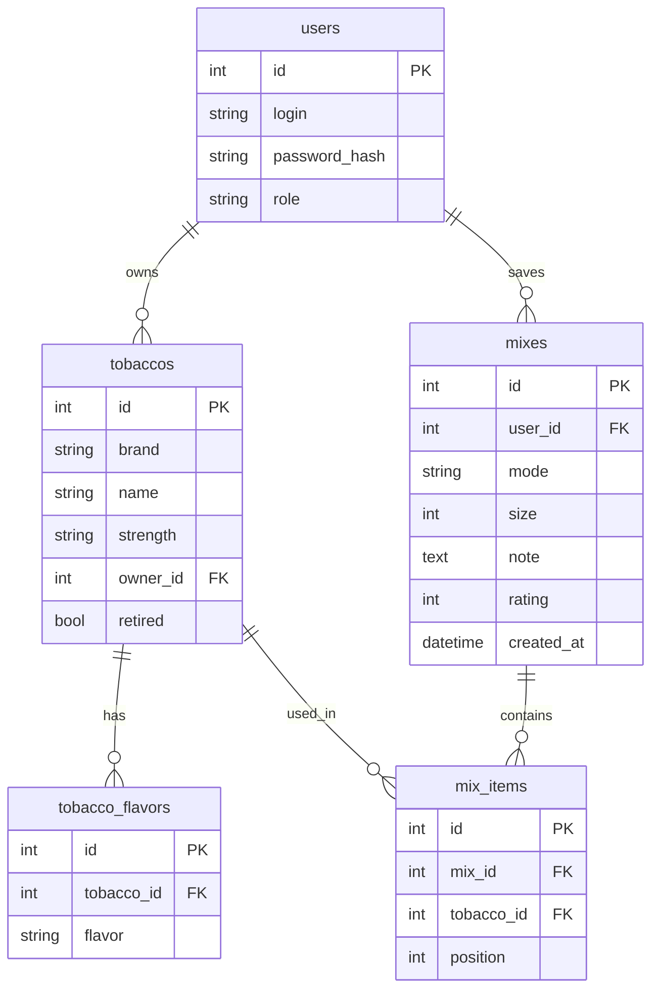

# Архитектура

Браузер ходит в nginx. Nginx отдаёт собранный клиент и проксирует `/api`, `/docs` и `/openapi.json` на FastAPI. FastAPI читает и пишет PostgreSQL.

Vercel и Render — сдача практики, а Compose — тот же контур на своём сервере.

## Таблицы

Пять таблиц. Каталожный табак — `tobaccos.owner_id IS NULL`. Свой — с `owner_id`. Вкусы живут отдельно, чтобы у одного табака было несколько меток.

## Сценарии

### Спин гостя

1. Открыть сайт без входа.
2. Выбрать размер и режим, при желании бренд, вкус или крепость.
3. Крутить рулетку: API берёт только общий каталог и не пишет смесь.
4. Посмотреть набор. Сохранить нельзя.

### Сохранение смеси

1. Войти.
2. Крутить рулетку (каталог, полка или оба).
3. Сохранить набор: API пишет `mixes` и `mix_items`.
4. В кабинете открыть историю, поставить заметку и оценку.

### Своя полка

1. Войти и открыть кабинет.
2. Добавить свой табак: бренд, название, крепость, вкусы.
3. Править или убрать позицию. Если табак уже в смеси, он помечается `retired`, а не удаляется.
4. Крутить рулетку с источником «полка» или «оба».

### Очистка и заливка каталога

1. Войти как администратор и открыть админку.
2. Очистить каталог: общие табаки получают `retired`.
3. Залить CSV: известные пары бренд+название обновляются и снимаются с `retired`, новые добавляются.
4. Рулетка гостя снова видит актуальный каталог.
